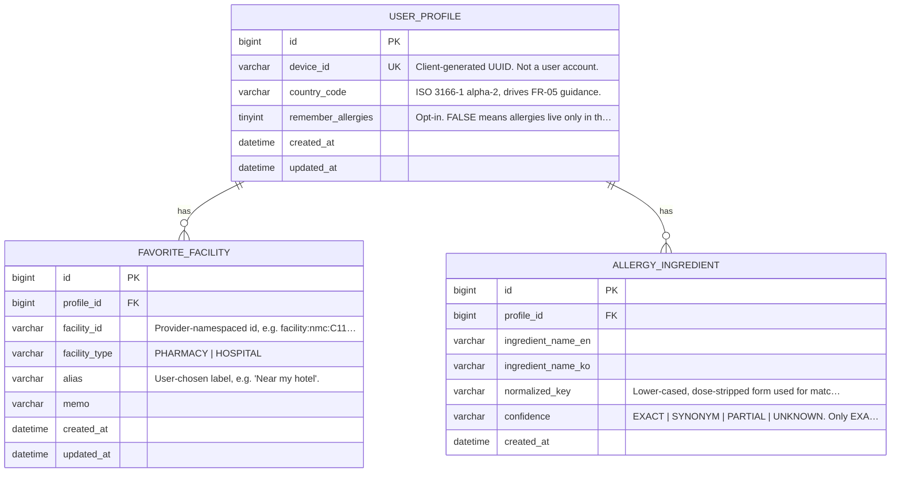

# ERD

> **이 문서는 실제 데이터베이스에서 생성했습니다.** 손으로 그린 것이 아닙니다.
> `./bin/gen-erd.py`로 재생성하세요. 같은 스키마에 대해 JPA `ddl-auto: validate`가 통과하므로
> **엔티티·마이그레이션·이 그림 셋이 일치**합니다.

## 무엇이 여기에 없는가 (그리고 왜)

| 데이터 | 어디에 | 왜 |
|---|---|---|
| **의료 상담 대화** | 브라우저 `sessionStorage` | 서버에 남기지 않겠다는 결정입니다 (spec §2-4, §2-16). 탭을 닫으면 사라집니다 |
| 즐겨찾기 스냅샷·설정 | 브라우저 `localStorage` | 표시용. 상세를 열 때 서버에서 다시 조회합니다 |
| 공공 API 응답 캐시 | Redis | 도메인 데이터가 아니라 호출 한도 대응입니다 |
| 의료기관·의약품 | (저장 안 함) | 우리가 소유하지 않는 참조 데이터입니다. 매 요청 공공 API에서 조회 |

**알레르기 성분은 사용자가 명시적으로 동의(`remember_allergies`)한 경우에만 이 DB에 들어옵니다.**
기본값은 꺼짐이고, 동의를 끄면 저장된 행이 삭제됩니다.

## 다이어그램



## 관계

| 관계 | 카디널리티 | 삭제 규칙 |
|---|---|---|
| `user_profile` → `allergy_ingredient` | 1 : N | `ON DELETE CASCADE` |
| `user_profile` → `favorite_facility` | 1 : N | `ON DELETE CASCADE` |

프로필이 사라지면 그에 딸린 성분과 즐겨찾기도 함께 사라집니다. 익명 프로필이므로 "탈퇴"는
프로필 행 하나를 지우는 일이고, 그것으로 그 사람의 모든 서버 데이터가 없어져야 합니다.

## 재생성

```bash
docker compose up -d
cd backend && ./gradlew bootRun    # Flyway가 마이그레이션을 적용하고 JPA가 검증합니다
./bin/gen-erd.py                   # 이 문서와 테이블 명세서를 다시 씁니다
```

이미 적용된 마이그레이션을 수정하면 Flyway 체크섬이 어긋납니다 (`docker compose down -v`로 초기화).
