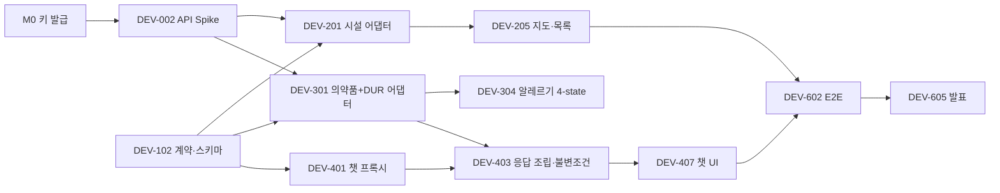

# 작업 분해 · 팀원 배분

> 이 문서가 채점 산출물 **3번 WBS**의 원본입니다.
> 각 항목은 그대로 GitHub Issue로 옮길 수 있는 크기입니다.
> 스펙: [`spec.md`](./spec.md) · 이슈 템플릿: `.github/ISSUE_TEMPLATE/task.yml`

---

## 0. 지금 어디까지 왔나 (2026-07-10)

**백엔드는 end-to-end로 동작합니다. 프론트엔드는 골격만 있습니다.**
테스트 275개, CI 3잡 초록. 실제 공공 API·실제 LLM·실제 MariaDB·Redis로 검증했습니다.

### 실제로 돌아가는 것 (라이브 API로 확인)

| | 확인한 내용 |
|---|---|
| **2-패스 RAG** | "I have a headache and a bit of fever" → 성분 추출 → 식약처 조회 → **실존 제품 3개**(삼남아세트아미노펜정·세토펜정·나르펜정)로만 답변. 출처·타임스탬프는 서버가 씁니다 |
| **환각 차단** | 불변조건 6이 **실제로 작동**합니다. 조회되지 않은 제품명은 이름이 아무리 그럴듯해도 거부됩니다 |
| **챗 프록시** | `openai` SDK가 붙고(단 `baseURL`은 **절대 URL이어야 합니다** — 상대 경로는 SDK가 `new URL()`에서 던집니다), 클라이언트 `system` 메시지가 제거되고, 인젝션이 막힙니다. `stream=true`도 **검증 후** 1청크로 나갑니다 |
| **지도** | 실제 브라우저에서 타일·핀 3개·InfoWindow 확인. 위치 거부 시 서울시청 폴백 + 그 사실을 표시 |
| **응급 선별** | "crushing chest pain"에 **모델을 부르지 않고** 31ms 만에 119 안내. 모델은 이걸 `urgency: unknown`이라 답했습니다 |
| **후처리 불변조건** | 7개 전부 요청 경로에 연결됨 |
| **의료기관** | `fixture` 모드로 네트워크 없이 실제 약국 3곳. 반경·영업중 계산, `INFERRED` 신뢰도 |
| **의약품** | `ITEM_SEQ`로 e약은요+허가정보+DUR 병합. 타이레놀 7종, 이트라코나졸 DUR 21건 |
| **알레르기** | 4-state 판정. `Acetaminophen Micronized`도 차단. `no_match_found`는 "안전"이 아님. 챗에서는 `mermaid.exclude_ingredients[]`로 받습니다 |
| **프로필 CRUD** | MariaDB 상대로 C/R/U/D 실증. 동의 없이는 알레르기 저장 불가, 동의 끄면 삭제 |
| **에러 계약** | 15개 코드 + `X-Request-Id` + `retryable`. 내부 정보 미노출. **그중 실제로 발생하는 건 5개** — 나머지는 정의만 돼 있습니다 |
| **산출물** | ERD·테이블 명세서를 실제 DB에서 생성. `ddl-auto: validate` 통과 |

> **챗 응답은 느립니다.** 콜드 100초 이상. 조회는 이미 4.7초로 줄였고(병렬화 완료), **나머지는 전부 LLM
> 왕복 2회**입니다. 같은 웜 요청이 215초 → 87초로 튈 만큼 프로바이더 편차가 큽니다.
> FE는 **로딩 상태를 반드시 그려야 합니다** (DEV-408).

### 다음에 할 일 (윤서진 = BE-1 + FE-1, 순서대로)

> 이 목록은 혼자 일하던 때 쓴 것이라 남의 레인을 가리키고 있었습니다. 팀이 합류했으니 **자기 레인만** 적습니다.
> **DEV-203 병원 검색은 BE-2(임수혁) 몫입니다.** 대신 해주지 마세요 — 그분의 첫 작업이 사라집니다.

1. **DEV-408 메인 챗 UI.** 지금 `App.tsx`는 걸어다니는 뼈대입니다. 콜드 응답이 **100초를 넘는데 화면엔 "Thinking…" 버튼 하나뿐**입니다. 진짜 로딩·진행 상태가 필요합니다.
2. **DEV-308 의약품 카드.** `AllergyBadge`는 완성돼 있고, 카드는 이름 + 경고 나열이 전부입니다.
3. **프론트 테스트 확장.** 47개가 붙었지만 `App.tsx`(챗 전체 흐름)와 `NearbyFacilities`는 안 덮였습니다.
4. **CI 결정 두 가지 (Lead 몫).** `oxlint`이 경고에도 `exit 0`이라 **CI의 lint 단계는 구조적으로 실패할 수 없습니다**(지금 경고 0이라 `--max-warnings=0`은 안전). 그리고 `tsconfig.app.json`에 `strict`가 없습니다. 둘 다 팀 PR을 갑자기 빨갛게 만들 수 있으니 합류 직후에 정하세요.
5. **DEV-004** NCP 대표 계정 무료량 확인.

> ✅ **문서화 완료.** [`AGENTS.md`](../../../AGENTS.md) — 안전 규칙과 그 근거, 브랜치·커밋 규약, 코드·주석 표기법,
> 자주 밟는 함정, 비개발자 안내까지. 사람과 AI 에이전트가 같은 문서를 봅니다.
>
> ✅ **프론트엔드 테스트 47개.** 이전엔 **하나도 없었고**, 그래서 `baseURL`이 상대 경로라 챗이 브라우저에서
> 전혀 안 되던 버그가 브라우저를 띄울 때까지 살아남았습니다. 다섯 파일 전부 **일부러 코드를 망가뜨려
> 빨간불이 뜨는지 확인**했습니다(대화를 `localStorage`로 옮기면 4개가 즉시 실패). CI가 `pnpm test`를 돌립니다.

> ✅ **DEV-003 완료 · DEV-206 대부분 완료.** 실제 브라우저에서 검증했습니다 — 타일이 그려지고, 약국 3곳에
> 핀이 찍히고, 핀을 누르면 이름·영업여부·거리·전화가 뜹니다. 위치 권한을 거부하면 **서울시청으로 폴백하고
> 그렇다고 말합니다.** `isOpenNow`가 `null`이면 "Hours unknown"입니다 — "Closed"가 아닙니다(§2-13).
>
> **DEV-206에 남은 것: GPS 거부 시 수동 위치 입력.** 지금은 서울시청으로 떨어질 뿐, 사용자가 직접 위치를
> 고를 방법이 없습니다. **DEV-207(상세 드로어 UI-03)은 손대지 않았습니다.**
>
> **네이버 키는 curl로 검증할 수 없습니다.** 틀린 키로도 `maps.js`가 200(바이트 수까지 동일)이고, `onload`가
> 발동하고, `naver.maps`가 정의되고, `new naver.maps.Map()`이 성공합니다. **그 뒤에야** `navermap_authFailure`가
> 불립니다. 그 콜백이 유일한 신호이고, 스크립트를 붙이기 **전에** 등록해야 합니다.
>
> ⚠ **`VITE_` 접두사가 붙은 값은 브라우저 번들에 문자열로 박힙니다.** Client Secret이 거기 들어가 있었고
> `dist/assets/index-*.js`에 컴파일됐습니다(폐기함). 이제 `vite.config.ts`가 `VITE_*SECRET*` 류 이름을 보면
> **빌드를 거부**합니다. Client ID는 `VITE_NAVER_MAP_CLIENT_ID`, Secret은 `NAVER_MAP_CLIENT_SECRET`(접두사 없음).

> ✅ **DEV-403 (2-패스 RAG) 완료.** `SearchTermExtractor` → `DrugService.retrieve()` → `DrugContextRetriever` →
> `ChatProxyController#answer`. 설계 근거와 실측 함정은 스펙 §2-2에 전부 적어뒀습니다.
>
> ✅ **조회 병렬화 완료.** `detail()` 8.79초 → 4.23초, `retrieve()` 콜드 4.68초.
> **동시성을 더 올리지 마세요** — 식약처가 서비스키 단위로 조입니다(DUR 4회: 순차 5.77초, 동시 2.70초 = 2.1배).
>
> ✅ **DEV-102 (`response_format` 주입) 완료.** 스키마는 `resources/schemas/mermaid-answer.provider.schema.json`.
> **허용목록**(`mermaid.llm.structured-output-models`)에 있는 모델에만 붙이고, 400이 나면 스키마 없이 1회 재시도합니다.
> **`AnswerValidator`는 그대로 돕니다** — 스키마를 완벽히 지키면서도 없는 약을 지어낼 수 있으니까요.
>
> ✅ **API 명세서 완료.** [`docs/deliverables/API_명세서.md`](../../deliverables/API_명세서.md).
> 코드 주석이 아니라 **실행 중인 서버의 응답**에서 만들었고, `./bin/verify-api-doc.sh`가 43개 검사로 지킵니다.
> 그 과정에서 병원 검색이 `200 []`(= "근처에 병원 없음"이라는 거짓말)을 돌려주던 것과, 미구현 스텁이
> `500`을 내던 것을 **`501 NOT_IMPLEMENTED`**로 고쳤습니다.

### 키·승인 (2026-07-10 전부 해결)

- ✅ **공공 API 8종 전부 200.** 심평원 병원정보·의료기관별상세정보, 국립중앙의료원 병·의원·응급실까지 승인됐습니다. `./bin/check-api-access.py`로 확인하세요.
- ✅ **네이버맵 `ncpKeyId` 발급됨.** 단 **`maps.js`는 가짜 키에도 200 + 333,436바이트를 돌려줍니다** — 서버에서 curl로는 유효성을 알 수 없습니다. 브라우저에서 `authFailure` 콜백을 봐야 합니다.
- ⬜ NCP 콘솔에서 **대표 계정 무료량**은 아직 미확인입니다(기존 계정 이력이 있으면 첫 호출부터 과금될 수 있습니다).

### 팀원이 지금 바로 시작할 수 있는 것

| 레인 | 담당 | 첫 작업 | 왜 지금 가능한가 |
|---|---|---|---|
| BE-2 | 임수혁 | **의료기관 도메인 읽고 자기 말로 설명**(§1) → DEV-202 주간 시간표 → DEV-203a~e 병원(5개로 분해됨) | `PublicApiResponse`가 봉투 두 종류를 다 풉니다. 병원 API 8종은 이미 승인됐고 실제 응답이 fixture에 있습니다. fixture로 개발하세요 |
| FE-1 | 윤서진 | **DEV-408 챗 UI** (로딩 상태 먼저) | astryx 셋업 완료. `MermAidAnswer` 타입이 `lib/types.ts`에 있습니다 |
| FE-2 | 박주형 | **DEV-207 상세 드로어** | DEV-106이 끝나 막힌 게 없습니다. 지도(DEV-206)와 저장소(DEV-501/502)는 **이미 끝나 있고 테스트가 지킵니다** — 다시 만들지 마세요 |
| PM/QA | 최정민 | **동의어 사전 검토** → 그다음 영어 문구 세트 | 검토자 칸이 전부 `TODO`입니다. **판정만 하면 되게 시트를 준비해뒀습니다** → [DEV-305 검토 시트](DEV-305-synonym-review.md) |

> 손이 비면: **DEV-601 계약 테스트**와 **DEV-604 접근성·모바일·영문 UX**가 선행작업이 풀려 지금 시작 가능합니다.

> ✅ **[2026-07-10 결정됨] 나프록센 건 — 계열 표를 만들지 않고 생성기를 묶었습니다.**
> "이부프로펜 알레르기"를 선언한 사용자에게 **나프록센**이 추천되던 문제입니다. 원인은 알레르기 판정이 아니라
> `SearchTermExtractor`였습니다 — **대체재를 고른 것은 LLM입니다.** 계열 교차반응 표는 임상 지식이고 팀에
> 임상 검토자가 없으므로, 표 대신 **알레르기가 선언된 턴에서 모델의 성분 제안을 전부 버립니다**
> (`AllergyDeclaration` → `DrugContextRetriever`, 스펙 SA-08). 임상 판단이 아니라 범위 축소라 서명이 필요 없습니다.
> 수용된 위험과 남는 노출은 스펙 **§7-1 AR-01**에 있습니다. **읽고 이의가 있으면 말해주세요.**
>
> ⚠ **PM/QA에게 아직 남은 것 (AR-02).** `synonyms.tsv` 7행의 검토자 칸이 전부 `TODO`인데 그 행들은 이미
> `blocked`를 만들고 있습니다. 특히 `dexibuprofen → ibuprofen`의 근거란은 *"cross-reactivity is expected"* —
> **서명 없는 교차반응 근거가 차단을 만들고 있습니다.** 서명 전까지 행을 추가하지 마세요.
>
> 임상 검토자를 확보하면 서명된 계열 표를 얹을 수 있습니다. 단 **생성기 제한을 대체하지 않고 그 위에** 얹습니다.

> **`DATA_MODE=fixture ./gradlew bootRun`** — 공공 API를 한 번도 부르지 않고 개발할 수 있습니다.
> 약국 API는 하루 1,000회뿐입니다. 그리고 실물 응답에서 알게 된 함정 17가지가
> [`fixtures/README.md`](../../../backend/src/main/resources/fixtures/README.md)에 정리돼 있으니
> **파서를 쓰기 전에 읽으세요.**

---

## 표기

- **P0** 필수 · **P1** 후순위 · **P2** 이번 과제 제외
- **S** 반나절 · **M** 1~2일 · **L** 2일 이상 또는 불확실성 큼
- ✅ 완료 · 🔧 진행 가능 · ⛔ 선행 작업 대기

---

## 1. 팀원 배분

팀은 4명, 직무 레인은 5개입니다. 개발 레인 넷(프론트 2 / 백엔드 2) 중 BE-1·FE-1을 윤서진이 겸직하고, 한 명이 PM·QA 레인입니다.
**전원이 프론트와 백엔드를 다 만지되**, 아래는 각자가 **책임지고 완료를 보증하는** 영역입니다.

> **소유권은 태스크가 아니라 도메인 단위입니다.** 초기 스캐폴딩 과정에서 리드가 먼저 작성한 코드가 있더라도,
> 그 도메인의 **완료 보증·버그 대응·확장·발표 설명은 표의 담당자 몫**이고, 리드는 그 영역에서 리뷰어로 물러납니다.
> 이관받은 도메인의 **첫 태스크는 "코드를 읽고(에이전트에게 설명시켜도 좋습니다) 팀에 자기 말로 설명하기"** —
> 이해 검증이자, 그대로 발표 조각이 됩니다(§4.5 발표 노트).

| 레인 | 담당 | 소유 도메인 (기작성 코드 포함) | 왜 이 묶음인가 |
|---|---|---|---|
| **BE-1 / Dev Lead** | 윤서진 | 챗 프록시, 2-패스 RAG, 후처리 불변조건, 안전 규칙, 의약품 3종 API, DataMode, CI·통합·리뷰 | 의약품 API 셋(e약은요·허가정보·DUR)은 `ITEM_SEQ` 조인으로 얽혀 있고 2-패스 RAG의 1단계입니다. 챗과 같은 사람이 쥐어야 경계가 갈리지 않습니다 |
| **BE-2** | 임수혁 | **의료기관 도메인 전체** — 약국 어댑터·Haversine·영업시간 계산(기작성분 포함), 병원 어댑터(DEV-203a~e), Redis 캐시, `GET /facilities` | 의료기관 도메인이 통째로 독립적이라 병렬 작업이 막히지 않습니다 |
| **FE-1** | 윤서진 | astryx 셋업, 챗 UI(UI-01), 의약품 카드, 알레르기 4-state 표시, safe fallback UI | 챗 화면과 카드가 한 덩어리입니다 |
| **FE-2** | 박주형 | **지도·저장소 도메인 전체** — 네이버맵(UI-02, 기작성분 포함), 상세 드로어(UI-03), 브라우저 저장소(기작성분 포함), 즐겨찾기 CRUD | 지도와 상세, 저장소가 한 흐름입니다 |
| **PM / UX / QA** | 최정민 | 요구사항 추적, 영어 문구·안전 문구, fixture 사람 검증, 테스트 실행, 발표·시연 | 개발자가 아니어도 **완료를 보증하는 산출물**을 냅니다 (아래 §4) |

> 이름은 수행계획서 v0.2(2026-07-10 수정본) §3 기준입니다. 팀원 4명에 직무가 5개라 BE-1·FE-1은 윤서진이 겸직합니다.

### 인계 지점

경계에서 누가 누구에게 무엇을 넘기는지 미리 정해둡니다. 여기서 막히면 프로젝트가 멈춥니다.

| 제공자 | 산출물 | 인수자 | 인수 기준 |
|---|---|---|---|
| BE-2 | `Facility` 정규화 타입 + fixture | FE-2, BE-1 | 스키마 검증 통과, `source` 포함 |
| BE-1 | `MermAidAnswerV1` 스키마 + safe fallback | FE-1, QA | 유효·무효 예시와 테스트 포함 |
| BE-1 | 의약품 카드 데이터(성분·DUR 결합) | FE-1 | `allergy_check` 4-state가 채워짐 |
| PM/UX | 영어 문구 세트 | FE-1, FE-2 | 모든 상태(빈·오류·로딩·차단)의 문구가 정의됨 |
| FE | 실행 가능한 화면 | QA | 로컬 실행법 또는 preview URL |
| QA | 버그 리포트 | 담당 개발자 | 재현 절차·기대·실제·증거 |

---

## 2. 마일스톤

| | 목표 | 종료 조건 |
|---|---|---|
| **M0** 결정·검증 | 스택·키·샘플 응답 확보 | 키 3종 발급, 공공 API 실응답 저장 |
| **M1** 계약·Fixture | 네트워크 없이 end-to-end 골격 | 스키마·fixture·에러 envelope 테스트 통과 |
| **M2** 데이터 | 의료기관·의약품 API 완성 | 목록·상세·필터·오류 처리 통과 |
| **M3** AI·UI 통합 | 질문 → 카드 → 지도 | 불변조건 통과, `ui_actions` 렌더링 |
| **M4** CRUD·안전 | 저장·개인정보·fallback | C/R/U/D, 장애 주입 테스트 통과 |
| **M5** 발표 | 배포·리허설 | 3회 연속 리허설 성공 |

### Critical path



---

## 3. 백로그

### EPIC 0 — 결정·검증

| ID | 작업 | P | Size | 담당 | 상태 |
|---|---|---|---|---|---|
| DEV-001 | 기술 스택·저장소 구조 결정 | P0 | S | Lead | ✅ `spec.md` §1 |
| DEV-002 | 공공 API 8종 Spike (실응답 확보) | P0 | L | BE-1, BE-2, QA | ✅ 전부 200 |
| DEV-003 | 네이버맵 키 발급 + `localhost` allowlist | P0 | S | FE-2 | ✅ 브라우저에서 확인 |
| DEV-004 | 대표 계정 무료량 확인 (NCP 콘솔) | P0 | S | 윤서진 | 🔧 [스펙 §3 미확인 항목] |

> **DEV-002는 끝났습니다.** 실제 응답 13종이 `backend/src/main/resources/fixtures/`에 있고, `data-mode: fixture`로 네트워크 없이 개발할 수 있습니다.
> 약국 API는 **하루 1,000회**뿐이니 fixture로 개발하세요. 디버깅에 한도를 쓰면 그날 개발이 끝납니다.
> 실물 응답에서 알게 된 함정 17가지가 `fixtures/README.md`에 있습니다 — 파서를 쓰기 전에 읽으세요.

### EPIC 1 — 기반·계약

| ID | 작업 | P | Size | 담당 | 상태 |
|---|---|---|---|---|---|
| DEV-101 | 저장소 scaffold, CI, 시크릿 가드 | P0 | M | Lead | ✅ |
| DEV-102 | `MermAidAnswerV1` 스키마 + 런타임 검증기 | P0 | M | BE-1 | ✅ 지원 모델엔 `response_format` 주입, 400이면 스키마 없이 1회 재시도 |
| DEV-103 | `DataMode` (live/hybrid/fixture) | P0 | S | BE-1 | ✅ |
| DEV-104 | Fixture 저장소 구성 | P0 | M | BE-2, QA | ✅ 실제 응답 13종 `src/main/resources/fixtures/` |
| DEV-105 | 공통 에러 envelope + `X-Request-Id` | P0 | M | BE-1 | ✅ |
| DEV-106 | **astryx 0.1.4 셋업 + Tailwind v4 레이어 브리지** | P0 | M | FE-1 | ✅ |

### EPIC 2 — 의료기관 (BE-2 · FE-2)

| ID | 작업 | P | Size | 담당 | 상태 |
|---|---|---|---|---|---|
| DEV-201 | Facility 어댑터 인터페이스 + fixture 구현체 | P0 | S | BE-2 | ✅ `PublicApiResponse` + `FixtureLoader` |
| DEV-202 | 약국 어댑터 — 위치조회 ✅ / **주간시간표(`getParmacyBassInfoInqire`) 남음** | P0 | M | BE-2 | 🔧 |
| DEV-203a | 병원 **목록** 어댑터 — `getHospBasisList` | P0 | M | BE-2 | 🔧 **API 승인됨**, 실응답 `fixtures/hospital_list.json`. 함정: `radius` **필수**(빼면 전국 79,727건), `XPos`=경도/`YPos`=위도, distance는 **미터**(약국과 반대) |
| DEV-203b | 병원 **상세** 어댑터 — `getDtlInfo2.8` (`ykiho` 단건) | P0 | M | BE-2 | ⛔ 203a. 오퍼레이션 이름에 버전 접미사(`getDtlInfo`는 404). 진료시간 파싱 — 일요일은 필드 없이 `noTrmtSun: "휴진"` |
| DEV-203c | `ykiho` 상세 **캐시** (상세는 N+1 — 하드 캐싱) | P0 | S | BE-2 | ⛔ 203b. Redis 직렬화 함정(§11: Java `record`는 JDK 직렬화 불가) |
| DEV-203d | `FacilityService.hospitals()` 연결 — `501` 제거 | P0 | M | BE-2 | ⛔ 203a~c. 기존 반경·영업중 계산(DEV-204) 재사용. 시간표 없는 기관은 `isOpenNow: null` — `false` 금지(§2-3) |
| DEV-203e | 병원 테스트·fixture 검증 + 발표 노트 3줄 | P0 | S | BE-2 | ⛔ 203d. 여기까지 오면 지도에서 병원 핀이 뜹니다 — **30초 시연 장면** |
| DEV-204 | 거리·영업중 필터 + `is_open_now` **nullable** | P0 | M | BE-2 | ✅ (주간시간표 붙이면 `INFERRED`→`OFFICIAL_SCHEDULE`) |
| DEV-205 | `GET /facilities` + provider namespace ID | P0 | M | BE-2 | ✅ 목록. 단건(`/{id}`)은 남음 |
| DEV-206 | 지도·목록 UI + GPS 거부 시 수동 위치 | P0 | L | FE-2 | 🔧 지도·목록·핀·폴백 완료. **수동 위치 입력 남음** |
| DEV-207 | 상세 드로어 (UI-03) + **바텀시트 직접 조립** | P0 | M | FE-2 | 🔧 미착수. DEV-106이 끝나 막힌 것은 없습니다 |
| DEV-208 | 공휴일 캘린더 (특일 정보 API) | P1 | M | BE-2 | 🔧 지금은 늘 평일 |

### EPIC 3 — 의약품·DUR·알레르기 (BE-1 · FE-1)

| ID | 작업 | P | Size | 담당 | 상태 |
|---|---|---|---|---|---|
| DEV-301 | e약은요 어댑터 (안내문) | P0 | M | BE-1 | ✅ |
| DEV-302 | 허가정보 어댑터 (성분, `MAIN_INGR_ENG`) | P0 | M | BE-1 | ✅ 목록·상세·성분검색 |
| DEV-303 | **DUR 어댑터** (병용·연령·임부·노인) | P1 | L | BE-1 | ✅ 4종 전부 |
| DEV-304 | `ITEM_SEQ` 기반 3종 병합 | P0 | M | BE-1 | ✅ 실제 API로 검증 |
| DEV-305 | 성분 정규화 + 검증된 동의어 사전 | P0 | M | BE-1, QA | ✅ 코드. **사전 검토는 QA 몫**. 판정만 하면 되게 근거를 모아뒀습니다 → [검토 시트](DEV-305-synonym-review.md) |
| DEV-306 | 알레르기 4-state 비교 서비스 | P0 | M | BE-1 | ✅ `AllergyChecker` |
| DEV-307 | `GET /drugs`, `GET /drugs/{id}` | P0 | M | BE-1 | ✅ |
| DEV-308 | 의약품 카드 UI + 4-state 시각 구분 | P0 | M | FE-1, PM/UX | 🔧 DEV-307 끝남. `AllergyBadge`는 완성, 카드는 이름+경고 나열 뿐 |
| DEV-309 | **동의어 사전 서명 + 아스피린 표준명 교정** (스펙 §7-1 **AR-02**) | P1 | S | 윤서진, PM/QA, BE-1 | 📋 **백로그.** 함께 검토·결정하고 서명한다. 아래 참고 |

> **DEV-309 — 무엇을 결정해야 하나.** [검토 시트](DEV-305-synonym-review.md)에 실측 근거가 다 있습니다. 세 덩어리입니다.
>
> 1. **경고 없이 통과하는 표기 4종** — `Dexibuprofen D.C.`(24), `Aspirin Enteric Pellets`(27), `Aspirin Enteric Granules`(2), `Aspirin Lysine For Injection 90%`(1). 알레르기가 있어도 아무 표시가 안 붙습니다.
> 2. **경고만 뜨고 차단되지 않는 표기 4종** — `Microencapsulated Acetaminophen`(12), `Ibuprofen Piconol`(22), `Ibuprofen Sodium Dihydrate`(1), `Ibuprofen Encapsulated`(1). 이 중 `Ibuprofen Piconol`만 화학·임상 판단이 필요합니다.
> 3. **표준명이 거꾸로 박힌 버그** — 허가정보에 `Acetylsalicylic Acid`는 **0건**, `Aspirin`은 119건. `toSearchTerm("Aspirin")`이 존재하지 않는 문자열을 내놓아 `GET /api/v1/drugs?ingredient=Aspirin`이 **빈 목록**입니다. 표기법 사실이라 확인은 쉽습니다.
>
> **미서명 행을 지우는 쪽이 위험한 방향입니다.** 그 행들이 없으면 알레르기가 매칭되지 않습니다. 서명 전까지 행을 **추가하지도 지우지도** 않습니다. 미서명 행은 매 부팅 WARN에 이름이 찍힙니다.
>
> **서명은 사람이 합니다.** 그 칸의 유일한 의미가 "사람이 확인했다"이므로, 에이전트가 채우면 그 칸은 그 순간부터 아무 뜻도 없어집니다.

> **DEV-305는 QA와 함께 합니다.** LLM만으로 성분 동의어를 확정하면 안 됩니다 (스펙 §2-12). 사람이 검토한 매핑 파일에 근거 메모를 남기세요.

### EPIC 4 — AI 챗·안전 (BE-1 · FE-1)

| ID | 작업 | P | Size | 담당 | 상태 |
|---|---|---|---|---|---|
| DEV-401 | Chat Completions 프록시 (키 은닉, system 제거) | P0 | M | BE-1 | ✅ |
| DEV-402 | 시스템 프롬프트 + 프롬프트 인젝션 방어 | P0 | M | BE-1, PM/UX | 🔧 부분 완료 |
| DEV-403 | 2-패스 RAG 조립 | P0 | L | BE-1 | ✅ `SearchTermExtractor` → `DrugContextRetriever` → `ChatProxyController` |
| DEV-404 | **서버 후처리 불변조건 7개** | P0 | M | BE-1 | ✅ 요청 경로에 연결됨 |
| DEV-405 | **규칙 기반 응급 선별** (LLM보다 먼저) | P0 | M | BE-1, PM/UX | ✅ 문구·패턴 검수는 PM/UX 남음 |
| DEV-406 | `ui_actions[]` allowlist 검증 | P0 | M | BE-1 | ✅ sealed interface + Jackson subtype |
| DEV-407 | Safe fallback 응답 | P0 | S | BE-1 | ✅ 부분 (`StructuredOutputFallback`) |
| DEV-408 | 메인 챗 UI + 개인정보 경고 + 응급 배너 | P0 | L | FE-1 | 🔧 DEV-106 끝남. 골격만 있음 — **로딩 상태 필수**(콜드 100초 이상) |
| DEV-409 | 스트리밍 UX (조립 후 검증) | P1 | M | BE-1, FE-1 | ✅ 백엔드 완료 |

### EPIC 5 — CRUD·저장·개인정보

| ID | 작업 | P | Size | 담당 | 상태 |
|---|---|---|---|---|---|
| DEV-501 | 버전형 브라우저 저장소 어댑터 (`schema_version`) | P0 | M | FE-2 | ✅ `lib/storage.ts`. 버전 불일치·손상 blob은 리셋 |
| DEV-502 | **채팅을 `sessionStorage`로** | P0 | S | FE-2 | ✅ `storage.test.ts`가 지킵니다 (§2-16) |
| DEV-503 | 서버 프로필 CRUD (JPA) | P0 | M | BE-1 | ✅ MariaDB에서 C/R/U/D 실증 |
| DEV-504 | 즐겨찾기 C/R/U/D UI | P0 | M | FE-2 | ⛔ DEV-207 |
| DEV-505 | 알레르기 opt-in (기본 OFF) | P0 | M | FE-1, BE-1 | ✅ 백엔드. UI는 FE-1 |
| DEV-506 | **ERD + 테이블 명세서 산출** | P0 | S | BE-1 | ✅ `docs/deliverables/` — 실제 DB에서 생성 |

### EPIC 6 — 테스트·보안·발표

| ID | 작업 | P | Size | 담당 | 상태 |
|---|---|---|---|---|---|
| DEV-601 | 계약 테스트 (스키마 유효·무효 fixture) | P0 | M | QA, BE-1 | 🔧 DEV-102 끝남. 지금 시작 가능 |
| DEV-602 | E2E 6종 (fixture 모드) | P0 | L | QA, FE, BE | ⛔ |
| DEV-603 | 보안·프롬프트 인젝션 점검 | P0 | M | BE-1, QA | 🔧 |
| DEV-604 | 접근성·모바일·영문 UX | P0 | M | FE, PM/UX | 🔧 DEV-106 끝남. 지금 시작 가능 |
| DEV-605 | 발표·시연 패키지 (대본·고정 데이터·리허설) | P0 | M | PM/QA + 전원 | ⛔ |
| DEV-606 | 배포·문서 동기화·릴리스 태그 | P0 | M | Lead, PM | ⛔ |
| DEV-610 | **README 공개용 전환** — 히어로 스크린샷·기능 GIF·아키텍처 그림·팀원별 "누가 무엇을 만들었나" | P1 | M | **PM/QA** | ⛔ 발표 주간. 발표 스토리와 레포의 얼굴을 같은 손으로. 그 전까지 README는 팀원의 북마크이므로 **변경 동결**(스크린샷 1장 제외) |

### P2 — 만들지 않을 것

로그인·계정·보호자 연결 · 시니어 데일리 체크·FCM · 서버 의료 기록 저장 · 예약·결제·보험 · 진단·처방·개인 복용량 · 비용 예측 · 동물병원 · 영어 외 다국어

---

## 4. PM·QA 레인이 소유하는 것

비개발자 조원이 "아이디어 제공"에 머물지 않게, **완료를 보증하는 산출물**을 갖습니다.

### 4.1 공공 API 샘플 사람 검증 (DEV-002, DEV-104)
개발자가 뽑아준 익명화 JSON을 보고, 기관명·주소·전화번호가 원본과 같은지, 운영시간이 사람이 읽었을 때 맞게 변환됐는지 확인합니다. 애매한 항목에 `unknown` 표시를 요청합니다.

```markdown
## DATA-REVIEW-XXX
- Fixture:
- Reviewed by:
- Correct fields:
- Incorrect or ambiguous fields:
- Decision needed:
```

### 4.2 영어 문구·안전 문구 (DEV-402, DEV-308, DEV-604)
다음 상태의 영어 문구를 쓰고 팀이 검토합니다. **진단·처방처럼 단정하지 않아야 합니다.**

첫 화면 개인정보 경고 · 응급 배너 · "영업 여부를 전화로 재확인" 안내 · 알레르기 `blocked`/`warning`/`no_match_found`/`unknown` 각각 · AI 실패 · 공공 API 실패 · fixture 사용 표시 · 빈 결과 · 위치 권한 거부

> **`no_match_found`의 문구가 가장 어렵습니다.** "일치하는 성분을 찾지 못했습니다"이지 "안전합니다"가 아닙니다.

### 4.3 테스트 실행 (DEV-602)
테스트 ID를 따라 수동 실행, 실제 휴대폰에서 위치 권한 흐름 확인, 화면 녹화, P/F와 재현 절차 기록. **버그는 구두가 아니라 Issue로.**

### 4.4 시연 운영 (DEV-605)
발표용 위치·질문 고정, `live`/`hybrid`/`fixture` 모드별 결과 확인, 외부 API 장애 시 전환 리허설, 발표자와 조작자 분리.

### 4.5 발표 노트 — 조기 축적 (DEV-605의 연료)
태스크를 끝낼 때마다 [`docs/발표-노트.md`](../../발표-노트.md)에 **"내가 만든 것 3줄 + 시연 장면 1개"**를 적습니다. 강제는 아니지만, 3주 뒤 발표 대본이 마지막 주의 벼락치기가 아니라 **팀원들 각자의 문장**으로 이미 쌓여 있게 하는 장치입니다. 파일 관리는 PM/QA가 맡되, 각 항목은 만든 사람이 씁니다 — "각자 자기 조각을 자기 입으로"가 이 프로젝트의 기여 원칙입니다.

---

## 5. 협업 규칙

**브랜치:** `feat/DEV-123-facility-search`, `fix/DEV-234-ai-schema-fallback`
**커밋:** `feat(facility): add normalized facility search` — 스코프는 [AGENTS.md §6](../../../AGENTS.md#6-commits)의 목록(`chat, drug, facility, web, config, ci, docs`)을 씁니다. 태스크 ID는 브랜치 이름과 PR이 나릅니다.

**진실은 한 곳에만 (GitHub Issues):** 태스크의 **살아 있는 상태**(누가 하는 중인지, 막혔는지, 끝났는지)는 GitHub Issues가 유일한 진실입니다. 이 문서의 §3 백로그는 **채점 산출물(WBS)용 스냅샷**이며, 마일스톤이 끝날 때만 일괄 갱신합니다 — 두 곳에 상태를 두면 반드시 갈라지고, 이 문서는 이미 두 번 자기 자신과 모순된 적이 있습니다.

### Definition of Ready
- [ ] **GitHub Issue가 존재하고 담당자가 지정되어 있다** (NFR-05 추적성)
- [ ] 이슈 ID와 연결된 FR/NFR/SA가 있다
- [ ] 포함·제외 범위가 있다
- [ ] 수용 기준이 테스트 가능하다
- [ ] 필요한 API 샘플·문구가 준비됐다
- [ ] 담당자가 이해하지 못한 용어가 없다

### Definition of Done
- [ ] 수용 기준을 모두 통과한다
- [ ] **정상·실패·빈 데이터** 흐름을 확인했다
- [ ] 테스트를 추가했다
- [ ] 사용자 문구가 확정됐다
- [ ] **로그와 화면에 비밀키·사용자 메시지 원문이 없다**
- [ ] API·스키마 변경이 `docs/`와 동기화됐다
- [ ] 스펙과 어긋나면 `spec.md`도 같은 PR에서 고쳤다

### 코드 리뷰
계약(`MermAidAnswerV1`, API)·안전(SA-01~07) 변경은 **2명**, 그 외는 1명.

---

## 6. 지금 코드에 남아 있는 `TODO(team)`

```bash
rg 'TODO\(team\)' backend/src frontend/src
```

| 위치 | 이슈 | 담당 |
|---|---|---|
| `PharmacyApiClient#weeklyHours` | DEV-202 | BE-2 |
| `FacilityService#hospitals` | DEV-203 (심평원 403 대기) | BE-2 |
| `FacilityController#detail` | DEV-205 | BE-2 |
| `HolidayCalendar#isHoliday` | DEV-208 | BE-2 |
| `DrugService#search`, `#detail` | DEV-301, DEV-307 | BE-1 |
| `ChatProxyService#prepare` (response_format — glm-5.2는 지원함) | DEV-102 | BE-1 |
| ~~`useNaverMap.ts` 마커 렌더링~~ | DEV-206 | ✅ `FacilityMap.tsx` |
| `App.tsx` 의약품 카드·지도 | DEV-308, DEV-408 | FE-1 |
| `ChatProxyController#blocking` (`retrievedProductNames`) | DEV-403 | BE-1 |
