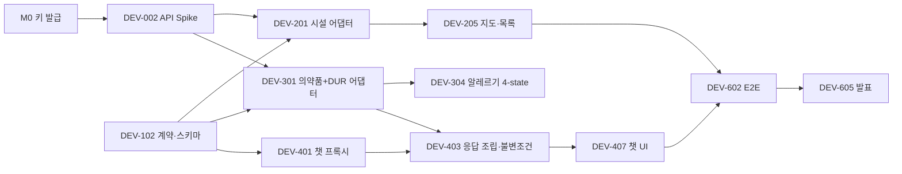

# 작업 분해 · 팀원 배분

> 이 문서가 채점 산출물 **3번 WBS**의 원본입니다.
> 각 항목은 그대로 GitHub Issue로 옮길 수 있는 크기입니다.
> 스펙: [`spec.md`](./spec.md) · 이슈 템플릿: `.github/ISSUE_TEMPLATE/task.yml`

## 표기

- **P0** 필수 · **P1** 후순위 · **P2** 이번 과제 제외
- **S** 반나절 · **M** 1~2일 · **L** 2일 이상 또는 불확실성 큼
- ✅ 완료 · 🔧 진행 가능 · ⛔ 선행 작업 대기

---

## 1. 팀원 배분

팀은 5명입니다. 넷이 개발 레인(프론트 2 / 백엔드 2), 한 명이 PM·QA 레인입니다.
**전원이 프론트와 백엔드를 다 만지되**, 아래는 각자가 **책임지고 완료를 보증하는** 영역입니다.

| 레인 | 담당 | 주 영역 | 왜 이 묶음인가 |
|---|---|---|---|
| **BE-1 / Dev Lead** | ASQi | 챗 프록시, 2-패스 RAG, 후처리 불변조건, 안전 규칙, 의약품 3종 API, DataMode, CI·통합·리뷰 | 의약품 API 셋(e약은요·허가정보·DUR)은 `ITEM_SEQ` 조인으로 얽혀 있고 2-패스 RAG의 1단계입니다. 챗과 같은 사람이 쥐어야 경계가 갈리지 않습니다 |
| **BE-2** | [이름] | 의료기관 API(약국·병원), Haversine·영업시간 계산, Redis 캐시, `GET /facilities` | 의료기관 도메인이 통째로 독립적이라 병렬 작업이 막히지 않습니다 |
| **FE-1** | [이름] | astryx 셋업, 챗 UI(UI-01), 의약품 카드, 알레르기 4-state 표시, safe fallback UI | 챗 화면과 카드가 한 덩어리입니다 |
| **FE-2** | [이름] | 네이버맵(UI-02), 상세 드로어(UI-03), 브라우저 저장소, 즐겨찾기 CRUD | 지도와 상세, 저장소가 한 흐름입니다 |
| **PM / UX / QA** | [이름] | 요구사항 추적, 영어 문구·안전 문구, fixture 사람 검증, 테스트 실행, 발표·시연 | 개발자가 아니어도 **완료를 보증하는 산출물**을 냅니다 (아래 §4) |

### 인계 지점

경계에서 누가 누구에게 무엇을 넘기는지 미리 정해둡니다. 여기서 막히면 프로젝트가 멈춥니다.

| 제공자 | 산출물 | 인수자 | 인수 기준 |
|---|---|---|---|
| BE-2 | `Facility` 정규화 타입 + fixture | FE-2, BE-1 | 스키마 검증 통과, `source` 포함 |
| BE-1 | `MermAidAnswerV1` 스키마 + safe fallback | FE-1, QA | 유효·무효 예시와 테스트 포함 |
| BE-1 | 의약품 카드 데이터(성분·DUR 결합) | FE-1 | `allergy_check` 4-state가 채워짐 |
| PM/UX | 영어 문구 세트 | FE-1, FE-2 | 모든 상태(빈·오류·로딩·차단)의 문구가 정의됨 |
| FE | 실행 가능한 화면 | QA | 로컬 실행법 또는 preview URL |
| QA | 버그 리포트 | 담당 개발자 | 재현 절차·기대·실제·증거 |

---

## 2. 마일스톤

| | 목표 | 종료 조건 |
|---|---|---|
| **M0** 결정·검증 | 스택·키·샘플 응답 확보 | 키 3종 발급, 공공 API 실응답 저장 |
| **M1** 계약·Fixture | 네트워크 없이 end-to-end 골격 | 스키마·fixture·에러 envelope 테스트 통과 |
| **M2** 데이터 | 의료기관·의약품 API 완성 | 목록·상세·필터·오류 처리 통과 |
| **M3** AI·UI 통합 | 질문 → 카드 → 지도 | 불변조건 통과, `ui_actions` 렌더링 |
| **M4** CRUD·안전 | 저장·개인정보·fallback | C/R/U/D, 장애 주입 테스트 통과 |
| **M5** 발표 | 배포·리허설 | 3회 연속 리허설 성공 |

### Critical path



---

## 3. 백로그

### EPIC 0 — 결정·검증

| ID | 작업 | P | Size | 담당 | 상태 |
|---|---|---|---|---|---|
| DEV-001 | 기술 스택·저장소 구조 결정 | P0 | S | Lead | ✅ `spec.md` §1 |
| DEV-002 | 공공 API 6종 Spike (실응답 확보) | P0 | L | BE-1, BE-2, QA | ✅ 심평원만 403 |
| DEV-003 | 네이버맵 키 발급 + `localhost` allowlist | P0 | S | FE-2 | 🔧 |
| DEV-004 | 대표 계정 무료량 확인 (NCP 콘솔) | P0 | S | ASQi | 🔧 [스펙 §3 미확인 항목] |

> **DEV-002는 끝났습니다.** 실제 응답 7종이 `backend/src/main/resources/fixtures/`에 있고, `data-mode: fixture`로 네트워크 없이 개발할 수 있습니다.
> 약국 API는 **하루 1,000회**뿐이니 fixture로 개발하세요. 디버깅에 한도를 쓰면 그날 개발이 끝납니다.
> 조사 문서가 틀렸던 여섯 곳은 `fixtures/README.md`에 정리돼 있습니다 — 파서를 쓰기 전에 읽으세요.

### EPIC 1 — 기반·계약

| ID | 작업 | P | Size | 담당 | 상태 |
|---|---|---|---|---|---|
| DEV-101 | 저장소 scaffold, CI, 시크릿 가드 | P0 | M | Lead | ✅ |
| DEV-102 | `MermAidAnswerV1` 스키마 + 런타임 검증기 | P0 | M | BE-1 | 🔧 `response_format` 주입만 남음 (glm-5.2는 지원) |
| DEV-103 | `DataMode` (live/hybrid/fixture) | P0 | S | BE-1 | ✅ |
| DEV-104 | Fixture 저장소 구성 | P0 | M | BE-2, QA | ✅ 실제 응답 7종 `src/main/resources/fixtures/` |
| DEV-105 | 공통 에러 envelope + `X-Request-Id` | P0 | M | BE-1 | ✅ |
| DEV-106 | **astryx 0.1.4 셋업 + Tailwind v4 레이어 브리지** | P0 | M | FE-1 | ✅ |

### EPIC 2 — 의료기관 (BE-2 · FE-2)

| ID | 작업 | P | Size | 담당 | 상태 |
|---|---|---|---|---|---|
| DEV-201 | Facility 어댑터 인터페이스 + fixture 구현체 | P0 | S | BE-2 | ✅ `PublicApiResponse` + `FixtureLoader` |
| DEV-202 | 약국 어댑터 — 위치조회 ✅ / **주간시간표(`getParmacyBassInfoInqire`) 남음** | P0 | M | BE-2 | 🔧 |
| DEV-203 | 병원 어댑터 (2단 호출 + `ykiho` 캐시) | P0 | L | BE-2 | ⛔ **심평원 API가 403** — 활용신청 승인 대기 |
| DEV-204 | 거리·영업중 필터 + `is_open_now` **nullable** | P0 | M | BE-2 | ✅ (주간시간표 붙이면 `INFERRED`→`OFFICIAL_SCHEDULE`) |
| DEV-205 | `GET /facilities` + provider namespace ID | P0 | M | BE-2 | ✅ 목록. 단건(`/{id}`)은 남음 |
| DEV-206 | 지도·목록 UI + GPS 거부 시 수동 위치 | P0 | L | FE-2 | ⛔ DEV-205 |
| DEV-207 | 상세 드로어 (UI-03) + **바텀시트 직접 조립** | P0 | M | FE-2 | ⛔ DEV-106 |
| DEV-208 | 공휴일 캘린더 (특일 정보 API) | P1 | M | BE-2 | 🔧 지금은 늘 평일 |

### EPIC 3 — 의약품·DUR·알레르기 (BE-1 · FE-1)

| ID | 작업 | P | Size | 담당 | 상태 |
|---|---|---|---|---|---|
| DEV-301 | e약은요 어댑터 (안내문) | P0 | M | BE-1 | ✅ |
| DEV-302 | 허가정보 어댑터 (성분, `MAIN_INGR_ENG`) | P0 | M | BE-1 | ✅ 목록·상세·성분검색 |
| DEV-303 | **DUR 어댑터** (병용·연령·임부·노인) | P1 | L | BE-1 | ✅ 4종 전부 |
| DEV-304 | `ITEM_SEQ` 기반 3종 병합 | P0 | M | BE-1 | ✅ 실제 API로 검증 |
| DEV-305 | 성분 정규화 + 검증된 동의어 사전 | P0 | M | BE-1, QA | ✅ 코드. **사전 검토는 QA 몫** (`resources/ingredients/synonyms.tsv`) |
| DEV-306 | 알레르기 4-state 비교 서비스 | P0 | M | BE-1 | ✅ `AllergyChecker` |
| DEV-307 | `GET /drugs`, `GET /drugs/{id}` | P0 | M | BE-1 | ✅ |
| DEV-308 | 의약품 카드 UI + 4-state 시각 구분 | P0 | M | FE-1, PM/UX | ⛔ DEV-307 |

> **DEV-305는 QA와 함께 합니다.** LLM만으로 성분 동의어를 확정하면 안 됩니다 (스펙 §2-12). 사람이 검토한 매핑 파일에 근거 메모를 남기세요.

### EPIC 4 — AI 챗·안전 (BE-1 · FE-1)

| ID | 작업 | P | Size | 담당 | 상태 |
|---|---|---|---|---|---|
| DEV-401 | Chat Completions 프록시 (키 은닉, system 제거) | P0 | M | BE-1 | ✅ |
| DEV-402 | 시스템 프롬프트 + 프롬프트 인젝션 방어 | P0 | M | BE-1, PM/UX | 🔧 부분 완료 |
| DEV-403 | 2-패스 RAG 조립 | P0 | L | BE-1 | 🔧 `DrugService.retrieve()` 준비됨. 챗 흐름에 연결만 남음 |
| DEV-404 | **서버 후처리 불변조건 7개** | P0 | M | BE-1 | ✅ 요청 경로에 연결됨 |
| DEV-405 | **규칙 기반 응급 선별** (LLM보다 먼저) | P0 | M | BE-1, PM/UX | ✅ 문구·패턴 검수는 PM/UX 남음 |
| DEV-406 | `ui_actions[]` allowlist 검증 | P0 | M | BE-1 | ✅ sealed interface + Jackson subtype |
| DEV-407 | Safe fallback 응답 | P0 | S | BE-1 | ✅ 부분 (`StructuredOutputFallback`) |
| DEV-408 | 메인 챗 UI + 개인정보 경고 + 응급 배너 | P0 | L | FE-1 | ⛔ DEV-106 |
| DEV-409 | 스트리밍 UX (조립 후 검증) | P1 | M | BE-1, FE-1 | ✅ 백엔드 완료 |

### EPIC 5 — CRUD·저장·개인정보

| ID | 작업 | P | Size | 담당 | 상태 |
|---|---|---|---|---|---|
| DEV-501 | 버전형 브라우저 저장소 어댑터 (`schema_version`) | P0 | M | FE-2 | 🔧 |
| DEV-502 | **채팅을 `sessionStorage`로** | P0 | S | FE-2 | 🔧 스펙 §2-16 |
| DEV-503 | 서버 프로필 CRUD (JPA) | P0 | M | BE-1 | ✅ MariaDB에서 C/R/U/D 실증 |
| DEV-504 | 즐겨찾기 C/R/U/D UI | P0 | M | FE-2 | ⛔ DEV-207 |
| DEV-505 | 알레르기 opt-in (기본 OFF) | P0 | M | FE-1, BE-1 | ✅ 백엔드. UI는 FE-1 |
| DEV-506 | **ERD + 테이블 명세서 산출** | P0 | S | BE-1 | ✅ `docs/deliverables/` — 실제 DB에서 생성 |

### EPIC 6 — 테스트·보안·발표

| ID | 작업 | P | Size | 담당 | 상태 |
|---|---|---|---|---|---|
| DEV-601 | 계약 테스트 (스키마 유효·무효 fixture) | P0 | M | QA, BE-1 | ⛔ DEV-102 |
| DEV-602 | E2E 6종 (fixture 모드) | P0 | L | QA, FE, BE | ⛔ |
| DEV-603 | 보안·프롬프트 인젝션 점검 | P0 | M | BE-1, QA | 🔧 |
| DEV-604 | 접근성·모바일·영문 UX | P0 | M | FE, PM/UX | ⛔ DEV-106 |
| DEV-605 | 발표·시연 패키지 (대본·고정 데이터·리허설) | P0 | M | PM/QA + 전원 | ⛔ |
| DEV-606 | 배포·문서 동기화·릴리스 태그 | P0 | M | Lead, PM | ⛔ |

### P2 — 만들지 않을 것

로그인·계정·보호자 연결 · 시니어 데일리 체크·FCM · 서버 의료 기록 저장 · 예약·결제·보험 · 진단·처방·개인 복용량 · 비용 예측 · 동물병원 · 영어 외 다국어

---

## 4. PM·QA 레인이 소유하는 것

비개발자 조원이 "아이디어 제공"에 머물지 않게, **완료를 보증하는 산출물**을 갖습니다.

### 4.1 공공 API 샘플 사람 검증 (DEV-002, DEV-104)
개발자가 뽑아준 익명화 JSON을 보고, 기관명·주소·전화번호가 원본과 같은지, 운영시간이 사람이 읽었을 때 맞게 변환됐는지 확인합니다. 애매한 항목에 `unknown` 표시를 요청합니다.

```markdown
## DATA-REVIEW-XXX
- Fixture:
- Reviewed by:
- Correct fields:
- Incorrect or ambiguous fields:
- Decision needed:
```

### 4.2 영어 문구·안전 문구 (DEV-402, DEV-308, DEV-604)
다음 상태의 영어 문구를 쓰고 팀이 검토합니다. **진단·처방처럼 단정하지 않아야 합니다.**

첫 화면 개인정보 경고 · 응급 배너 · "영업 여부를 전화로 재확인" 안내 · 알레르기 `blocked`/`warning`/`no_match_found`/`unknown` 각각 · AI 실패 · 공공 API 실패 · fixture 사용 표시 · 빈 결과 · 위치 권한 거부

> **`no_match_found`의 문구가 가장 어렵습니다.** "일치하는 성분을 찾지 못했습니다"이지 "안전합니다"가 아닙니다.

### 4.3 테스트 실행 (DEV-602)
테스트 ID를 따라 수동 실행, 실제 휴대폰에서 위치 권한 흐름 확인, 화면 녹화, P/F와 재현 절차 기록. **버그는 구두가 아니라 Issue로.**

### 4.4 시연 운영 (DEV-605)
발표용 위치·질문 고정, `live`/`hybrid`/`fixture` 모드별 결과 확인, 외부 API 장애 시 전환 리허설, 발표자와 조작자 분리.

---

## 5. 협업 규칙

**브랜치:** `feat/DEV-123-facility-search`, `fix/DEV-234-ai-schema-fallback`
**커밋:** `feat(DEV-123): add normalized facility search`
**GitHub Projects:** `Backlog → Ready → In Progress → In Review → QA → Done` (막히면 `Blocked` + 사유 링크)

### Definition of Ready
- [ ] 이슈 ID와 연결된 FR/NFR/SA가 있다
- [ ] 포함·제외 범위가 있다
- [ ] 수용 기준이 테스트 가능하다
- [ ] 필요한 API 샘플·문구가 준비됐다
- [ ] 담당자가 이해하지 못한 용어가 없다

### Definition of Done
- [ ] 수용 기준을 모두 통과한다
- [ ] **정상·실패·빈 데이터** 흐름을 확인했다
- [ ] 테스트를 추가했다
- [ ] 사용자 문구가 확정됐다
- [ ] **로그와 화면에 비밀키·사용자 메시지 원문이 없다**
- [ ] API·스키마 변경이 `docs/`와 동기화됐다
- [ ] 스펙과 어긋나면 `spec.md`도 같은 PR에서 고쳤다

### 코드 리뷰
계약(`MermAidAnswerV1`, API)·안전(SA-01~07) 변경은 **2명**, 그 외는 1명.

---

## 6. 지금 코드에 남아 있는 `TODO(team)`

```bash
rg 'TODO\(team\)' backend/src frontend/src
```

| 위치 | 이슈 | 담당 |
|---|---|---|
| `PharmacyApiClient#weeklyHours` | DEV-202 | BE-2 |
| `FacilityService#hospitals` | DEV-203 (심평원 403 대기) | BE-2 |
| `FacilityController#detail` | DEV-205 | BE-2 |
| `HolidayCalendar#isHoliday` | DEV-208 | BE-2 |
| `DrugService#search`, `#detail` | DEV-301, DEV-307 | BE-1 |
| `ChatProxyService#prepare` (response_format — glm-5.2는 지원함) | DEV-102 | BE-1 |
| `useNaverMap.ts` 마커 렌더링 | DEV-206 | FE-2 |
| `App.tsx` 의약품 카드·지도 | DEV-308, DEV-408 | FE-1 |
| `ChatProxyController#blocking` (`retrievedProductNames`) | DEV-403 | BE-1 |
